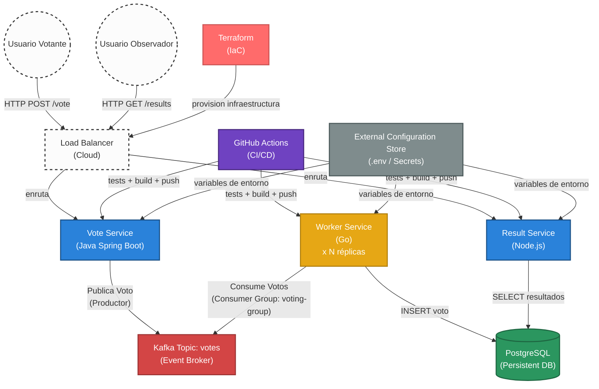

# Taller 1 - Construcción de Pipelines en Cloud
**Curso:** Ingeniería de Software V  
**Fecha de Presentación:** 13 de Abril
**Proyecto Base:** [Microservices Demo (Okteto)](https://github.com/okteto/microservices-demo)

---

## Metodología Ágil Seleccionada

* **Metodología:** Scrum
* [cite_start]**Justificación:** Como se menciona, el proyecto debe poder ser utilizado por un equipo ágil, por lo que se escoge scrum como metodología a usar. Esto permite alta adaptabilidad a cambios, entregas tempranas y frecuentes de valor funcional, y una rápida retroalimentación.

---

## 1. Estrategias de Branching Para Desarrolladores

* **Modelo:** GitHub Flow
* **Descripción:** 
    * **Rama `main`:** Siempre debe estar en un estado desplegable. No se toca directamente.
    * **Ramas `feature/nombre-tarea`:** Cada desarrollador crea una rama corta para una funcionalidad o corrección específica.
    * **Pull Requests (PR):** Antes de integrar a `main`, se requiere revisión de código y que las pruebas automatizadas pasen en el pipeline.
    * **Fusión (Merge):** Una vez aprobado, se fusiona a `main` y se dispara el despliegue automático.
* **Justificación:** 
    * Esta estrategia garantiza que cualquier código integrado haya pasado ya por un proceso de validación, manteniendo la estabilidad de la rama de producción de manera constante.
    * Al realizar cada modificación (nueva funcionalidad o corrección de errores) en una rama independiente derivada de la principal, se facilita el seguimiento del proceso de desarrollo por medio de los nombres descriptivos de cada rama y el desarrollo paralelo (no dependo de los otros miembros del equipo de desarrollo).
    * Imponer un flujo basado en pull requests permite que el código sea evaluado y validado por otros miembros del equipo antes de su integración.
    * La validación y el testing se realizan en la rama de la funcionalidad antes de la fusión, lo que mitiga el riesgo de introducir código inestable en la rama principal.
    * Facilita la incorporación rápida de cambios al CI/CD pipeline dado a su simplicidad.


---

## 2. Estrategias de Branching Para Operaciones

* **Modelo:** GitOps (Modelo Branch-per-Environment)
* **Descripción:** Su objetivo principal es que el repositorio sea la única fuente de verdad del estado de tus entornos.
    * Rama `main`: Representa el entorno de pre-producción, donde los pipelines de desarrollo (CI) actualizan las etiquetas de las imágenes Docker automáticamente tras pasar las pruebas.
    * Rama `production`: Representa el estado real de lo que ven los usuarios finales. Nadie hace cambios directos aquí.
    * Para pasar un cambio de Pre-Producción a Producción se abre un Pull Request de `main` hacia `production`.
    * Sincronización Automática: Una vez que el PR se aprueba y se hace merge, se desencadena una actualización de infraestructura.
* **Justificación:** 
    *  **Fuente Única de Verdad:** El estado de la infraestructura está totalmente definido y versionado en el repositorio.
    * **Control de Promoción:** Los cambios pasan de `main` (Pre-producción) a `production` solo mediante Pull Requests aprobados, evitando errores manuales.
    * **Automatización:** El despliegue se activa automáticamente tras el merge, garantizando que el entorno refleje exactamente el código.
    * **Estabilidad y Auditoría:** Ofrece un rastro claro de quién cambió la infraestructura y permite reversiones (rollbacks) rápidas ante fallos.

---

## 3. Patrones de Diseño de Nube
*Se han implementado al menos dos patrones basándonos en los temas expuestos en clase para garantizar la escalabilidad y resiliencia del proyecto.*

1. **Patrón 1: Producer-Consumer (con Competing Consumers)**
        * **Propósito:** Separa productores y consumidores para procesar mensajes de forma desacoplada y escalable.
        * **Implementación en el proyecto:**
            - **Productor:** `vote` publica eventos de voto en Kafka.
            - **Consumidor:** `worker` consume del topic `votes`.
            - **Competing Consumers:** múltiples instancias de `worker` pueden ejecutar en paralelo usando consumer group `voting-group` y estrategia `RoundRobin`.
            - **Consistencia:** `worker` persiste con `ON CONFLICT`, usando `msg.Key` como ID único de votante para evitar duplicados.

2. **Patrón 2: Publisher-Subscriber (Pub/Sub) / Comunicación Asíncrona**
    * **Propósito:** Desacopla las partes de un sistema que producen eventos (publicadores) de aquellas que los procesan (suscriptores). El componente que emite la información no necesita esperar la respuesta, mejorando la disponibilidad y la respuesta inmediata al usuario final.
    * **Implementación en el proyecto:** 
      - **`vote` (Productor):** Publica voto en topic Kafka `votes` (mediante `kafkaTemplate.send()`) y retorna éxito al usuario en <100ms.
      - **`worker` (Consumidor):** Asíncrono y desacoplado, procesa en background sin afectar la UX del frontend.
      - **`result` (Lector):** Lee datos consolidados de PostgreSQL (escritos por worker) para mostrar resultados en tiempo real.
      - **Ventaja:** El servicio `vote` nunca bloquea esperando confirmación; el `worker` procesa cuando puede sin presión de tiempo.

3. **Patrón 3: External Configuration Store**
        * **Propósito:** Centraliza configuración operativa fuera del código para facilitar cambios por entorno sin recompilar.
        * **Implementación en el proyecto:**
            - Se creó `.env.example` como plantilla de configuración centralizada.
            - `docker-compose.yml` consume variables (`POSTGRES_*`, `KAFKA_*`, puertos, topic, polling interval).
            - `vote`, `worker` y `result` leen endpoints y parámetros desde variables de entorno con valores por defecto.
            - Permite promover de dev a preprod/prod cambiando configuración, no código.

## 4. Diagrama de Arquitectura (15.0%) [cite: 10]
A continuación se presenta el flujo de la aplicación *Docker Voting App* y su interacción a nivel de servicios y datos e infraestructura abstraída en red.



**Explicación del flujo:**
1. Los **usuarios** interactúan a través de un *Load Balancer/Ingress* en la nube que enruta el tráfico a los microservicios.
2. El servicio **`vote`** es una interfaz web ligera (Spring Boot) que acepta el voto y lo publica directamente en el topic Kafka `votes` (Producer Pattern).
3. Múltiples instancias del **`worker`** (Go) consumen competitivamente del topic Kafka usando consumer group `voting-group`, garantizando escalabilidad horizontal (Competing Consumers Pattern).
4. Cada **`worker`** recibe votos con `msg.Key = ID_votante`, insertándolos en PostgreSQL con identificación única (evita duplicados).
5. El servicio **`result`** (Node.js) lee datos consolidados directamente de PostgreSQL y los sirve en tiempo real al usuario observador.


---

## 5. Pipelines de Desarrollo (15.0%) [cite: 11]
*Detalle de la automatización del ciclo de vida de la aplicación.*

* **Herramienta:** (Ej: GitHub Actions, GitLab CI, Jenkins)
* **Tareas incluidas:** (Build, Unit Testing, Linting, Dockerization).
* **Scripts clave:** ```bash
    # Ejemplo de script de build/test
    npm install
    npm test
    ```

---

## [cite_start]6. Pipelines de Infraestructura (5.0%) [cite: 12]
*Automatización del despliegue de recursos.*

* **Herramienta:** (Ej: Terraform, CloudFormation, Ansible)
* **Descripción:** (Pasos para aprovisionar el clúster o servicios de nube).

---

## [cite_start]7. Implementación de la Infraestructura (20.0%) [cite: 13]
* **Proveedor Cloud:** (Ej: AWS, Azure, GCP, Okteto)
* **Componentes:** (Lista de servicios utilizados: K8s, Bases de Datos managed, Load Balancers, etc.)

---

## [cite_start]8. Guía para Demostración en Vivo (15.0%) [cite: 14]
*Pasos rápidos para demostrar cambios en el pipeline durante la presentación (8 min):*
1. Realizar un cambio en el código fuente.
2. Hacer `git push`.
3. Observar el disparo automático del pipeline.
4. Verificar el despliegue exitoso en el entorno de nube.

---

## [cite_start]9. Documentación y Resultados (10.0%) [cite: 15]
* **Enlace al Repositorio:** https://baselang.com/blog/basic-grammar/aca-vs-aqui-vs-ahi-vs-alli-vs-alla/
* **Evidencias:** (Screenshots de los pipelines en verde, logs de despliegue).